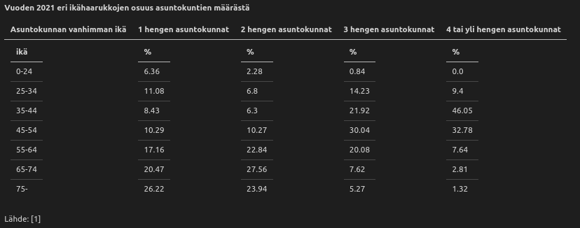
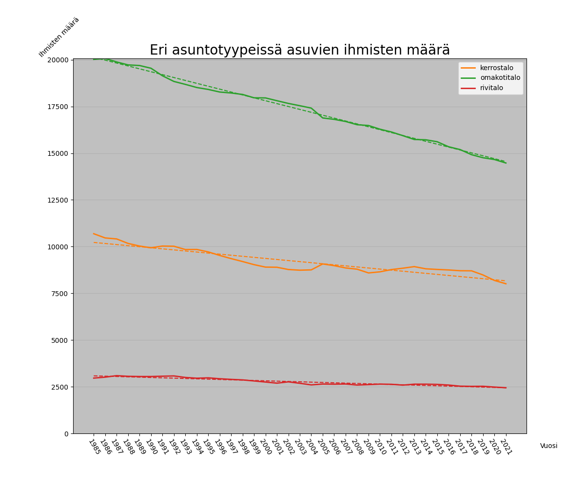

# Imatran asunto- ja ympäristöpolitiikan suunnittelua avustava data-analyysi, julkinen version <!-- omit in toc -->

## Sisällysluettelo <!-- omit in toc -->

- [**1 Esittely**](#1-esittely)
- [**2 Menetelmät**](#2-menetelmät)
	- [**2.1 Ohjelmistot**](#21-ohjelmistot)
	- [**2.2 Datan keräys**](#22-datan-keräys)
	- [**2.3 Datan-analysointi ja esitys**](#23-datan-analysointi-ja-esitys)
- [**3 Tulokset**](#3-tulokset)
	- [**3.1 Väestö (V)**](#31-väestö-v)
		- [**Väkiluku ja ennuste**](#väkiluku-ja-ennuste)
		- [**Väkiluku ja ennuste sukupuolittain**](#väkiluku-ja-ennuste-sukupuolittain)
		- [**Väkiluku ja ennuste ikäluokittain**](#väkiluku-ja-ennuste-ikäluokittain)
		- [**Miesten (ja naisten) prosentuaalinen osuus väestöstä iän mukaan**](#miesten-ja-naisten-prosentuaalinen-osuus-väestöstä-iän-mukaan)
		- [**Ikäpyramidi**](#ikäpyramidi)
		- [**Keskimääräinen vuotuinen väkiluvun muutos iättäin**](#keskimääräinen-vuotuinen-väkiluvun-muutos-iättäin)
		- [**Nopeiten kasvaneet ja vähenneet ikäluokat**](#nopeiten-kasvaneet-ja-vähenneet-ikäluokat)
		- [**Muutot *pois* Imatralta**](#muutot-pois-imatralta)
		- [**Muutot Imatralle**](#muutot-imatralle)
	- [**3.2 Asumistrendit (A)**](#32-asumistrendit-a)
		- [**Asuntokuntien koko**](#asuntokuntien-koko)
		- [**Asuntokuntien koko kerrostalossa**](#asuntokuntien-koko-kerrostalossa)
		- [**Asuntokuntien koko omakotitalossa**](#asuntokuntien-koko-omakotitalossa)
		- [**Yhden hengen asuntokuntien asukkaan ikä**](#yhden-hengen-asuntokuntien-asukkaan-ikä)
		- [**Kahden hengen asuntokuntien vanhimman asukkaan ikä**](#kahden-hengen-asuntokuntien-vanhimman-asukkaan-ikä)
		- [**Kolmen hengen asuntokuntien vanhimman asukkaan ikä**](#kolmen-hengen-asuntokuntien-vanhimman-asukkaan-ikä)
		- [**Yli kolmen hengen asuntokunnan vanhimman asukkaan ikä**](#yli-kolmen-hengen-asuntokunnan-vanhimman-asukkaan-ikä)
		- [**Asuntokunnan koon ja asuntokunnan vanhimman jakauma**](#asuntokunnan-koon-ja-asuntokunnan-vanhimman-jakauma)
		- [**Väkiluku asuntotyypeittäin**](#väkiluku-asuntotyypeittäin)
		- [**Väkiluku asuntotyypeittäin (%)**](#väkiluku-asuntotyypeittäin-)
		- [**Vuokra-asunnot hallintaperusteen mukaan**](#vuokra-asunnot-hallintaperusteen-mukaan)
	- [**3.3 Talous ja työllisyys (T)**](#33-talous-ja-työllisyys-t)
		- [**Bruttokansantuote henkilöä kohden**](#bruttokansantuote-henkilöä-kohden)
		- [**Yksityisyritysten liikevaihto**](#yksityisyritysten-liikevaihto)
		- [**Typaikkojen määrä aloittain**](#typaikkojen-määrä-aloittain)
		- [**Pendelöinti**](#pendelöinti)
		- [**Gini -kerroin**](#gini--kerroin)
		- [**Työttömyysaste**](#työttömyysaste)
		- [**Päätoiminta**](#päätoiminta)
	- [**3.4 Alueittain (AL)**](#34-alueittain-al)
		- [**Väkiluku**](#väkiluku)
		- [**Alle 18 vuotiaat**](#alle-18-vuotiaat)
		- [**Alle 18 vuotiaat (%)**](#alle-18-vuotiaat-)
		- [**Yli 65 vuotiaat**](#yli-65-vuotiaat)
		- [**Yli 65 vuotiaat (%)**](#yli-65-vuotiaat-)
		- [**Asumistiheys**](#asumistiheys)
		- [**Tyhjät asuinrakennukset heatmap**](#tyhjät-asuinrakennukset-heatmap)
		- [**Tyhjät asuinrakennukset heatmap ja pisteet**](#tyhjät-asuinrakennukset-heatmap-ja-pisteet)
		- [**Tyhjät asuinrakennukset painotettuna rakennuksen iällä**](#tyhjät-asuinrakennukset-painotettuna-rakennuksen-iällä)
		- [**Tyhjät, ennen 1930 valmistuneet rakennukset**](#tyhjät-ennen-1930-valmistuneet-rakennukset)
		- [**Kiinnostavat alueet Google Mapsissa**](#kiinnostavat-alueet-google-mapsissa)
		- [**Keskitulot**](#keskitulot)
		- [**Työttömyysprosentti**](#työttömyysprosentti)
		- [**Keskimääräinen väestönmuutos**](#keskimääräinen-väestönmuutos)
		- [**Palvelualojen osuus työpaikoista**](#palvelualojen-osuus-työpaikoista)
- [**4 Päätelmät**](#4-päätelmät)
- [**Lähteet**](#lähteet)

## **1 Esittely**
### **1.1 Julkaisua varten kansioon tehtyjä muokkauksia**
Tämä kansio sisältää ainostaan julkaisuturvalliset osat data-analyysistä ja sen tuloksista. 
Tästä versiosta poistettua:
- Maksullinen sekä yksityinen data:
	- Tilastokeskuksen ruututietokanta
	- Imatran asuntotietokanta
- Osa näistä dataseteistä ja niiden kuvaajista tehdyistä päätelmistä

Muokattua:
- Ruututietokannasta tehtyjä tuloksia muokattu poistamalla kaikki ruudut joissa on <50 ihmistä. Muuten tuloksista voisi päätellä mm. joidenkin tyhjien asuntojen sijainteja
- Asuntotietokannan datasta asukkaiden lukumäärät satunnaistettu
- Muokatusta asuntotietokannasta tehdyt kuvaajat eivät siis pidä paikkaansa, vaan ne ovat julkisessa versiossa ainoastaan havainnollistuksena tehdyistä kuvaajista

### **1.2 Tausta**

Asunto- ja ympäristöpolitiikalla (jatkossa AYP) tarkoitetaan tässä tutkimuksessa käytänteitä ja suunnitteluperiaatteita ympäristön kehityksessä.

Ympäristön kehitykseen kuuluu mm. asuntojen rakentaminen, rakennuslupien myöntäminen, palvelujen ja liiketilojen sijoituksen hallinta sekä tiestön- ja kulkureittien suunnittelu ja kehitys.

AYP:n tavoitteena on vastata nykyisten ja tulevien kunnan asukkaiden asunto- ja ympäristötarpeisiin mahdollisimman hyvin kehittämällä ihmisten asuinympäristöä: maksimoida kunnan ihmisten määrä ja tyytyväisyys nyt ja tulevaisuudessa.

Tämän analyysin tavoitteena on esittää tilastoja ja tutkimuksia ja siten auttaa Imatran AYP:n tekoa. AYP on todella monimutkainen kokonaisuus, jonka hyvä ymmärtäminen vaatisi enemmän asiantuntemusta ja dataa kuin itselläni on. Tämän takia analyysissä ei suoraan keskitytä antamaan AYP ratkaisuja, vaan tarjotaan tietoja Imatran nykytilanteesta, tapahtuneista muutoksista ja kehityssuunnista, joita AYP:tä tekevät ihmiset voivat hyödyntää suunnitelmissaan.

## **2 Menetelmät**
### **2.1 Ohjelmistot**
Data-analyysissa valittiin henkilökohtaisesti mielenkiintoiseksi tai AYP:n kannalta olennaiseksi koettua dataa. Aikasarjoissa on aina kaikkien saatavilla olevien vuosien data. Analyysissä käytettiin Python-3.8.10 versiota, sekä [requirements.txt](requirements.txt) kirjastoja. Kartta-analyysissä käytettiin QGIS 3.26.1-Buenos Aires -ohjelmistoa. Kartta-analyysin taustakarttana käytettiin Maanmittauslaitoksen taustakartta sarjaa WMS yhteydellä [https://tiles.kartat.kapsi.fi/taustakartta/](https://tiles.kartat.kapsi.fi/taustakartta/).

### **2.2 Datan keräys**
Data-analyysissa aloitettiin datan etsimisellä ja keräämisellä. Postinumeroalueittaisen tiedon saamiseksi lähetettiin POST -kyselyjä ([code/fetch/TilkeskQuery.py](./code/fetch/TilkeskQuery.py)) [Tilastokeskuksen Paavo PxWeb tietokantaan](https://www.stat.fi/tup/paavo/index.html) Python koodin avulla. Yhdellä kyselyllä pystyi saamaan yhden vuoden, yhden aiheen (esim. työllisyys) tiedot, kaikilta postinumeroalueilta. Aluksi siis ladattiin kaikki vuodet, ja aihealueet jonka jälkeen yhden vuoden kaikki tiedot yhdistettiin [code/fetch/fetch_postinumeroittain.py](./code/fetch/fetch_postinumeroittain.py) tiedostossa. Tämän jälkeen postialueen tiedot kerättiin yhteen tiedostoon lyhyeksi aikasarjaksi [code/handle/combine_files_by_postal_code.py](./code/handle/combine_files_by_postal_code.py) tiedostossa ja joiltain vuosilta puuttuvat tilastot jätettiin tyhjiksi. Datan yhdistyksen tehtyä postinumeroalueittaiset tiedot yhdistettiin vielä yhdeksi Imatraa kuvaavaksi tiedostoksi summaamalla (esim. väkiluku) tai keskiarvoistamalla (esim. keskitulot) postinumeroalueittaiset tiedot [code/handle/handle.py](./code/handle/handle.py) tiedostossa. Alkuperäiset vuosittain ja aiheittain eritellyt tiedostot poistettiin turhuuden, koon ja määrän takia.

Koska postinumeroalueittaista tietoa oli varsin vähän ja lyhyeltä ajalta, päädyin lisäämään dataa käyttämällä [Tilastokeskuksen Stafin PxWeb tietokantaa](https://www.stat.fi/tup/statfin/index.html). Palveluun lähetettiin erilaisia POST -kyselyjä ([code/fetch/querys](./code/fetch/querys/)). Tietoja ladattiin ja tallennettiin .xlsx muotoon Statfin tietokannasta [code/fetch](./code/fetch/) kansion *fetch_asunto.py, fetch_vaesto.py, fetch_raha.py* tiedostoilla. Pääsääntöisesti datan käsittely haluttuun muotoon suoritettiin jo näiden tiedostojen funktioissa, mutta osaa tiedostoista muokattiin vielä jälkikäteen [code/handle/handle.py](./code/handle/handle.py) funktioilla.

Osa datasta tuli tilastokeskuksen ulkopuolelta. [data/kartta/](./data/kartta/) kansion tiedostot tulivat Imatran Kaupungilta. [data/asuntodata/Imatra_asunnot_kayttotilanne.xlsx](./data/asuntodata/Imatra_asunnot_kayttotilanne.xlsx) tiedosto tuli Tilastokeskukselta sähköpostitse.

### **2.3 Datan-analysointi ja esitys**

Datan keräämisen jälkeen datan esitys hoidettiin [code/analyze/](./code/analyze/) kansiossa. Datan esittämisen auttamiseksi luotiin [code/analyze/ModelSet.py](./code/analyze/ModelSet.py) -luokka, johon datataulukko ja sen ominaisuuksia tallennettin (esim. jokaisen muuttujan lineaarisen regression tulos valitun riippumattoman muuttujan suhteen). Luokan teon jälkeen, luotiin [code/analyze/analyze.py](./code/analyze/analyze.py) -tiedosto, joka sisältää funktioita jotka luovat datasta kuvaajan ModelSet -luokan avulla. Jokaiselle kuvaajalle luotiin erillinen funktio [code/analyze/](./code/analyze/) kansion *_raha_plots.py, _vaesto_plots.py ja _asunto_plots.py* tiedostoissa. [code/analyze/plots.py](./code/analyze/plots.py) -tiedosto keräsi kaikki funktiot em. tiedostoista ja ajoi niistä ne jotka alkoivat "plot_" -merkkijonolla ja tallensi kuvaajat niille kuuluvaan sijaintiin [results/figures/](results/figures/) kansioon ja nimesi kuvat funktion nimellä, merkkijono "plot_" poistettuna.

Osa kuvaajista (pääosin [results/figures/talous_ja_tyollisyys](results/figures/talous_ja_tyollisyys/) kansio sekä tässä tiedostossa ei esillä olevat kuvaajat) ladattiin manuaalisesti eri lähteistä Internetistä. Kuvaajat, jotka haettiin manuaalisesti olivat joko yksinkertaisia eivätkä vaatineet käsittelyä, tai kuvaajan muodostuksessa käytetty data ei ollut saatavilla. Näiden kuvaajien datalle ei löydy [data/](./data/) kansiosta taulukoita.

Karttadatan analysoinnissa käytettiin QGIS -ohjelmistoa. Karttadatana käytettiin Tilastokeskuksen maksullista 250m X 250m ruututietokantaa [10], Imatran Kaupungin omistamaa rakennustietokantaa, sekä em. käsiteltyä postinumeroalueittaista tietoa. Postinumeroalueittaisen datan viimeisimmät tiedot, sekä laskennalliset uudet kentät (esim. väkiluvun trendi) laskettiin ja tallennettiin [code/analyze/_paavo.py](./code/analyze/_paavo.py) -tiedostossa. Postinumeroalueiden geometria haettiin QGIS ohjelmassa [Tilastokeskuksen WFS rajapinnasta](https://www.stat.fi/org/avoindata/paikkatietoaineistot/paavo.html). Tämän jälkeen geometriat tallennettiin Shapefile tiedostoon, ja postinumeroalueittaiset viimeisimmät tiedot lisättiin shapefileen ja tallennettin geojson muodossa [code/analyze/geo.py](./code/analyze/geo.py) tiedostossa.

**HUOM. Kuvaajissa, jotka löytyvät [results/figures/](./results/figures/) -kansiosta, mutta ei ole tässä tiedostossa, saattaa olla virheellisesti esitettyä tietoa. Eikä niitä ole tarkistettu.**

## **3 Tulokset**
Tässä kappaleessa käydään läpi erilaisia tilastoja. Imatran tasolta on saatavilla huomattavasti enemmän erilaisia mittauksia pidemmältä ajalta. Huonona puolena Imatran tason datassa on se, että siitä ei voi tehdä vahvoja paikallisia päätelmiä, esim. miten Keskustan väestö on muuttunut suhteessa Vuoksenniskan väestöön.
Imatran tulokset ovat tarkempia ja niitä on enemmän, mutta niiden alueellinen oikeellisuus on pienempi kuin alueellisen datan.

### **3.1 Väestö (V)**

#### **Väkiluku ja ennuste**
>
*Kuva V1. Imatran väkiluku 1972 - 2021 ja Tilastokeskuksen ennuste 2021 - 2040. Tilastointivälillä Imatran väkiluku on vähentynyt keskimäärin **-224 henkilöä/vuosi** ja **-0.62 %/vuosi**. Lähteet: [1,2]*

#### **Väkiluku ja ennuste sukupuolittain**
>
*Kuva V2. Imatran väkiluku sukupuolittain. Kautta tilastointiajan, Imatralla on ollut enemmän naisia kuin miehiä. Lähteet: [1,2]*

#### **Väkiluku ja ennuste ikäluokittain**
>
*Kuva V3. Imatran väkiluku 20 vuoden ikäluokittain. Lähteet: [1,2]*

#### **Miesten (ja naisten) prosentuaalinen osuus väestöstä iän mukaan**
>
*Kuva V4. Miesten osuus kokonaisväkiluvusta vuonna 2021 eriteltynä ikävuosittain. Kuvaajasta huomaa, että naisia on huomattavasti enemmän kuin miehiä yli 70 vuotiaissa. Lähteet: [1]*

#### **Ikäpyramidi**
>
*Kuva V5. Imatran ikäjakauma vuonna 2021. Naisten määrä on merkattu negatiivisena ikäpyramidin saamiseksi. Lähteet: [1]*

#### **Keskimääräinen vuotuinen väkiluvun muutos iättäin**
>
*Kuva V6. Viimeisen 7 vuoden väkiluvun trendi ikäluokittain. Lähteet: [1]*

#### **Nopeiten kasvaneet ja vähenneet ikäluokat**
> 
*Kuva V7. Keskimääräinen vuosittainen muutos viimeisen seitsemän vuoden aikana. Lähteet: [1]*
>

<!--
**Taulukko suurimmista ikäluokan keskimääräisistä muutoksista viimeisen 7 vuoden aikana (Lähde: [1]):**
<table>
<tr>
<th>Top 10 nopeiten vähenevät ikäluokat</th>
<th>Top 10 nopeiten kasvavat ikäluokat</th></tr>
<tr><td>

|Ikä|Muutos [hlö/vuosi]|
|:----|----:|
|50| -16.53|
|51| -15.54|
|52| -14.80|
|20| -14.79|
|21| -14.66|
|63| -14.00|
|19| -13.92|
|64| -13.85|
|65| -13.64|
|49| -13.53|
</td>
<td>

|Ikä  | Muutos [hlö/vuosi] |
|:----|----:|
|72| 17.77|
|70| 15.04|
|71| 13.75|
|73| 13.34|
|74| 11.06|
|80| 8.58|
|82| 7.05|
|69| 6.59|
|81| 6.33|
|75| 6.13|
</td></tr> </table>
<!-->

#### **Muutot *pois* Imatralta**
>
*Kuva V8. Viisi suurinta kuntaa, joihin Imatralta muutetaan. Lappeenranta on ainoa muuton kohde, joka on lisääntynyt merkittävästi. Vuonna 2021 Lappeenrantaan muutettiin 390 kertaa Imatralta. Lähde: [3]*

#### **Muutot Imatralle**
>
*Kuva V9. Viisi suurinta kuntaa, joista muutetaan Imatralle. Jälleen Lappeenranta on ainoa kunta, josta Imatralle muuttaminen on lisääntynyt merkittävästi. Vuonna 2021 Lappeenrannasta muutettiin Imatralle 280 kertaa. Lähde: [3]*

### **3.2 Asumistrendit (A)**

**Asuntokunnan määritelmä**
>Asuntokunnan muodostavat kaikki samassa asuinhuoneistossa vakinaisesti asuvat henkilöt. Väestön keskusrekisterin mukaan vakinaisesti laitoksissa kirjoilla olevat, asunnottomat, ulkomailla ja tietymättömissä olevat henkilöt eivät väestölaskennassa muodosta asuntokuntia. Asuntolarakennuksiksi luokitelluissa rakennuksissa asuvat henkilöt, joiden asunto ei täytä asuinhuoneiston määritelmää, eivät muodosta asuntokuntia. Vuoden 1980 väestölaskennassa myös näistä henkilöistä muodostettiin asuntokuntia.

>Asuntokuntakäsite otettiin käyttöön vuoden 1980 väestölaskennassa. Sitä aikaisemmissa laskennoissa käytettiin ruokakuntakäsitettä. Ruokakunnan katsottiin muodostuvan yhdessä asuvista perheenjäsenistä ja muista henkilöistä, joilla oli yhteinen ruokatalous. Alivuokralainen, jolla oli oma ruokatalous, muodosti oman ruokakuntansa. Vuodesta 1980 alivuokralainen kuuluu samaan asuntokuntaan muiden asunnossa asuvien kanssa.

Lähde: [4]

#### **Asuntokuntien koko**
>
*Kuva A1. Asuntokuntien määrä eriteltynä asuntokuntien koon mukaan. Yhden hengen asuntokunnissa olijoiden määrä on kasvanut huomattavasti. Yksin asumisen lisääntyminen selittynee sillä, että moni vanhus asuu yksin. Yksin asumisen lisääntyminen on myös maanlaajuinen trendi. Vuonna 2021 50.3% kaikista Imatran asuntokunnista olivat yhden hengen asuntokuntia. Lähde: [4]*

#### **Asuntokuntien koko kerrostalossa**
>
*Kuva A2. Kerrostalossa asuvien asuntokuntien määrä jaoteltuna koottain. Vuonna 2021 Imatralla oli 4264 kerrostalossa yksin asuvaa. Lähde: [4]*

#### **Asuntokuntien koko omakotitalossa**
>
*Kuva A3. Omakotitalossa asuvien asuntokuntien määrä vuosittain, jaoteltuna koottain. Omakotitaloissa yksin asumisen trendi ei ole erityisen näkyvä. Lähde: [4]*

#### **Yhden hengen asuntokuntien asukkaan ikä**
>
*Kuva A4. Yhden hengen asuntokuntien asukkaan ikä. Lähde: [4]*

#### **Kahden hengen asuntokuntien vanhimman asukkaan ikä**
>
*Kuva A5. Kahden hengen asuntokuntien vanhimman asukkaan ikä. Lähde: [4]*

#### **Kolmen hengen asuntokuntien vanhimman asukkaan ikä**
>
*Kuva A6. Kolmen hengen asuntokuntien vanhimman asukkaan ikä. Lähde: [4]*

#### **Yli kolmen hengen asuntokunnan vanhimman asukkaan ikä**
>
*Kuva A7. Yli kolmen hengen asuntokuntien vanhimman asukkaan ikä. Lähde: [4]*

#### **Asuntokunnan koon ja asuntokunnan vanhimman jakauma**

*Kuva A8. Erikokoisten asuntokuntien vanhimman asukkaan ikäluokan prosentuaalinen osuus. Lähde: [4]*

<!--
**Vuoden 2021 eri ikähaarukkojen osuus asuntokuntien määrästä**
<table>
<tr>
<th>Asuntokunnan vanhimman ikä</th>
<th>1 hengen asuntokunnat</th>
<th>2 hengen asuntokunnat</th>
<th>3 hengen asuntokunnat</th>
<th>4 tai yli hengen asuntokunnat</th>
</tr>
<tr><td>

|ikä|
|-----|
|0-24|
|25-34|
|35-44|
|45-54|
|55-64|
|65-74|
|75-|
</td>

<td>

|%|
|---|
|6.36|
|11.08|
|8.43|
|10.29|
|17.16|
|20.47|
|26.22|
</td>

<td>

|%|
|---|
|2.28|
|6.8|
|6.3|
|10.27|
|22.84|
|27.56|
|23.94|
</td>

<td>

|%|
|---|
|0.84|
|14.23|
|21.92|
|30.04|
|20.08|
|7.62|
|5.27|
</td>

<td>

|%|
|---|
|0.0|
|9.4|
|46.05|
|32.78|
|7.64|
|2.81|
|1.32|
</td>
</tr> 
</table>

Lähde: [1]
<!-->

#### **Väkiluku asuntotyypeittäin**
>
*Kuva A9. Väkiluku asuntotyypeittäin. Kuvasta näyttää hämäävästi, että omakotitalo asumisen haluttavuus vähenee. Lähde: [4]*

#### **Väkiluku asuntotyypeittäin (%)**
>
*Kuva A10. Väkiluku asuntotyypeittäin (prosenttia kokonaisväkiluvusta). Tästä kuvasta huomataan, että eri asuntotyyppien suhteellinen osuus on pysynyt likimain samana vuodesta 1985 lähtien. Lähde: [4]*

#### **Vuokra-asunnot hallintaperusteen mukaan**
>
*Kuva A11. Vuokra-asunnot hallintaperusteen mukaan. Arava tai korkotukivuokra-asuntojen määrä on laskenut huomattavasti. Lähde: [4]*

<!--
>
*Kuva A12. Imatralla sijaitsevat ei vakituisesti asutut asunnot. Asunto ei ole asuinkäytössä, jos asunnossa ei väestötietojärjestelmän mukaan asu yhtään henkilöä vakituisesti tai tilapäisesti. Lähde: [1]*
-->

### **3.3 Talous ja työllisyys (T)**

#### **Bruttokansantuote henkilöä kohden**
>
*Kuva T1. Imatran seutukunnan sekä koko Suomen bruttokansantuote per henkilö. Lähde: [8]*

#### **Yksityisyritysten liikevaihto**
>
*Kuva T2. Imatran seutukunnan yritysten liikevaihto Lähde: [8]*

#### **Typaikkojen määrä aloittain**
>
*Kuva T3. Imatran kuusi eniten työllistävää alaa 2007-2020. Teollisuuden työpaikat ovat vähentyneet huomattavasti. Lähde: [7]*

#### **Pendelöinti**
>
*Kuva T4. Imatralaisten työpaikat Imatralla vs toisella kunnalla työskentelyn mukaan. Lähde: [7]*

#### **Gini -kerroin**
>
*Kuva T5. Suomen, Helsingin ja Imatran Gini-kerroin. [Gini kerroin](https://fi.wikipedia.org/wiki/Gini-kerroin) kuvaa tulojen jakautumisen tasaisuutta. 0 = jokaisella sama tulo, 100=yksi henkilö saa kaikki tulot. Lähde: [7]*

#### **Työttömyysaste**
>
*Kuva T6. Imatran työttömyysaste vuosittain. Lähde: [9]*

#### **Päätoiminta**
>
*Kuva T7. Imatralaisten paatoiminta vuosittain. Lähde: [9]*

### **3.4 Alueittain (AL)**

Heatmap kuvaajissa on käytetty QGis ohjelman [heatmap](https://docs.qgis.org/2.18/en/docs/user_manual/plugins/plugins_heatmap.html) metodia 200m säteisellä clusteroinnilla.

**Tyhjällä asunnolla** tarkoitetaan rakennusta, jolle pätee:
- Rakennustyypissä asuu yhteensä yli 100 henkilöä Imatralla ('Yhden asunnon talot', 'Rivitalot', 'Asuntolat, vanhusten palvelutalot, asuntolahotellit', 'Kahden asunnon talot', 'Muut erilliset pientalot', 'Muut kerrostalot', 'Luhtitalot')
- Rakennuksen käytössäolotilanteeksi ei ole kirjattu jotain seuraavista: 'Hylätty ränsistymisen takia', 'Purettu muusta syystä', 'Purettu uudisrakentamisen takia', 'Tuhoutunut', 'Poistettu virheellisenä'
- Rakennuksen asukasmääräksi on merkattu 0.

Imatralla on 910 nämä kriteerit täyttävää asuntoa.

**Pisteiden painotuksella**
- Tarkoitetaan tässä kappaleessa QGIS ohjelmiston heatmap kartan valintaa *'Weight points by: [muuttuja]'*. Tämä metodi monistaa pisteet muuttujan arvon mukaan, ja suorittaa vasta sitten heatmap clusteroinnin.

#### **Väkiluku**
>
*Kuva AL1. Väkiluku 250m X 250m ruuduissa vuonna 2018. Mansikkala, Sienimäki ja Imatrankoski näyttävät olevan tiheiten asuttuja alueita. Lähde: [10]*

#### **Alle 18 vuotiaat**
>
*Kuva AL2. Alle 18-vuotiaiden määrä 250x250 ruuduissa vuonna 2018. Lähde: [10]*

#### **Alle 18 vuotiaat (%)**
>
*Kuva AL3. Alle 18-vuotiaiden määrän prosenttiosuus 250x250 ruuduissa vuonna 2018. Lähde: [10]*

#### **Yli 65 vuotiaat**
>
*Kuva AL4. Yli 65-vuotiaiden määrä 250x250 ruuduissa vuonna 2018. Lähde: [10]*

#### **Yli 65 vuotiaat (%)**
>
*Kuva AL5. Yli 65-vuotiaiden määrän prosenttiosuus 250x250 ruuduissa vuonna 2018. Lähde: [10]*

#### **Asumistiheys**
>
*Kuva AL6. Tässä karttakerroksessa näkyy heatmap, jossa jokainen rakennus on painotettu sen asukasmäärällä. Eli rakennukset joissa on (kirjoilla) 0 asukasta poistetaan, ja rakennukset joissa asuu ihmisiä monistetaan ihmismäärällä. Sen jälkeen alueet ryhmitellään sen mukaan, paljonko sijainnissa on rakennuksia.  Lähde: [12]*

#### **Tyhjät asuinrakennukset heatmap**

*Kuva AL7. Heatmap alueellaa sijaitsevista tyhjistä asunnoista. **HUOM!** Tämä kuvaaja on tehty satunnaisen datan pohjalta, jotta tyhjien asuntojen keskittymiä ei voi hyödyntää.
Lähde: [12]*

#### **Tyhjät asuinrakennukset heatmap ja pisteet**

*Kuva AL8. Heatmap tyhjistä asunnoista, sekä asuntojen tarkat sijainnit. Lähde: [12]*

#### **Tyhjät asuinrakennukset painotettuna rakennuksen iällä**

*Kuva AL9. Tyhjät asunnot painotettuna rakennuksen iällä. Huomataan mm. - Lähde: [12]*

#### **Tyhjät, ennen 1930 valmistuneet rakennukset**
>
*Kuva AL10. Heatmap alueellaa sijaitsevista tyhjistä asunnoista, jotka ovat valmistuneet ennen vuotta 1930 (126kpl). Ei painotusta. Lähde: [12]*

Suurimpaan osaan rakennuksista ei ole kirjattu tilannetta (esim. *'Hylätty ränsistymisen takia'* on vain 14 kpl). Asuntojen ikää voidaan ajatella korvikemuuttuja asuntojen huonokuntoisuudelle.

#### **Kiinnostavat alueet Google Mapsissa**
Poistettu

#### **Keskitulot**
>
*Kuva AL11. Asukkaiden keskitulo postinumeroalueittain vuonna 2020. Lähde: [11]*

#### **Työttömyysprosentti**
>
*Kuva AL12. Työttömyys prosentti postinumeroalueittain vuonna 2019. Työttömyys prosentti on laskettu kaavalla: "Työttömät" / ("18-64 vuotiaat" - "Opiskelijat" - "Muut työvoiman ulkopuolella olevat") HUOM. Tarkkaa työttömyysastetta ei ole saatavilla, vaan kyseiset luvut ovat approksimaatioita. Virhettä aiheuttavat seuraavat asiat: alle 64 vuotiaat eläkeläiset lasketaan tässä työvoimaksi, ja alle 18- ja yli 64 vuotiaiden opiskelijoiden määrä vähennetään työvoimasta. Lähde: [11]*

#### **Keskimääräinen väestönmuutos**
>
*Kuva AL13. Keskimääräinen vuosittainen väestönmuutos (%) 2013 - 2020 postinumeroalueittain. Lähde: [11]*

#### **Palvelualojen osuus työpaikoista**
>
*Kuva AL14. Palvelualojen osuus (%) työpaikoista postinumeroalueittain vuonna 2019. Lähde: [11]*

## **4 Päätelmät**

Tässä kappaleessa kerron omia Imatran AYP:hen liittyviä ideoita, jotka perustuvat tämän tutkimuksen aikana luettuun kirjallisuuteen, tässä esitettyihin tuloksiin, sekä omaan kokemukseen ihmisistä. Huomioitavaa on, että oma paikallistuntemus on kuitenkin huono ja (asunto)poliittinen kokemus 0.

1. Imatran keskustan aluetta pitäisi eheyttää ja palveluja keskittää. Nuoret, varsinkin sinkut, tahtovat asua lähellä ihmisiä ja vilkasta sosiaalista aluetta. Eheä ja vilkkaampi keskusta tarjoaa kaikille tekemistä, ja keskustan keskittäminen myös virkistää siellä toimivia yrityksiä ja saa kaupungin näyttämään elävältä. Keskusta voi olla pieni, mutta tiivis. Keskustaan ja sen välittömään läheisyyteen kohtuullisen tiivistä asumista; kerrostalo tai rivitalo alueita.

2. Vuoksenniskaa yms. asuntokeskittymiä keskustan ulkopuolella pitäisin edelleen lähtökohtaisesti omakotitaloalueina. Näille alueille tarvitsee myös paikallistaa palveluja ja suunnitella rakentamista sen mukaan. Lähellä paikallista keskustaa pitäisin pieniä (matala vuokraisia) omakotitaloja ja rivitaloja (ehkä kerrostaloakin). Hieman kauempana paikallisesta keskustasta enemmän omakotitaloalueita. Näillä alueilla tulee olla kouluja ja tekemistä nuorille.

3. Vanhusten ja säännöllistä hoitoa tarvitsevien määrä ja osuus tulevat kasvamaan tulevaisuudessa. Vanhemmat ihmiset tarvitsevat alueella luontoa, palveluja, ja muitakin ihmisiä kuin vanhuksia.

4. Teollisuuden työpaikat on erittäin tärkeää pitää Imatralla, koska teollisuus on suuri työllistäjä ja osaavien nuorten houkutin Imatralle. Palvelualojen työpaikat taas pysyvät helpommin Imatralla väestön tarpeiden takia. Lappeenrantaa kannattaa yrittää hyödyntää näiden suurien alojen työvoiman tarpeisiin.

5. Kaupungin tuntemattomuus jättää paljon asioita (väärien) mielikuvien varaan. Mikäli Imatralla asuisi hetken, tai kävisi useammin, niin kaupunki muuttuisi tutummaksi. Esim. jos Vuoksi olisi vielä tunnetumpi kaloistaan, kalastajat kävisivät siellä uudestaan ja uudestaan. Imatra muttuisi heille tutummaksi ja todennäköisemmäksi vaihtoehdoksi asua tai ainakin hankkia kesämökki. Sama pätee mm. opiskelijoiden kesätöihin ja harjoittelu jaksoihin.

Imatralla houkuttelevimpia asioita itselle ovat: Saimaa, halvat asunnot (ei absoluuttinen halpuus, vaan hinta-laatu suhde) ja teollisuus.
Vähiten houkuttelevia asioita ovat: kaupungissa totuttujen palvelujen puute/vähyys, rajan läheisyys, yleisesti kaupungin tuntemattomuus.

[Urban demographics - Why do people live where they do](https://www.centreforcities.org/reader/urban-demographics-2/why-do-people-live-where-they-do/)

[Kaikki kotona? Asumisen uudet tuulet](https://www.storytel.com/fi/fi/books/kaikki-kotona-asumisen-uudet-tuulet-129581)

## **Lähteet**

1. Suomen virallinen tilasto (SVT): Väestörakenne [verkkojulkaisu].
ISSN=1797-5379. Helsinki: Tilastokeskus [viitattu: 15.6.2022].
Saantitapa: http://www.stat.fi/til/vaerak/index.html
2. Suomen virallinen tilasto (SVT): Väestöennuste [verkkojulkaisu].
ISSN=1798-5137. Helsinki: Tilastokeskus [viitattu: 15.6.2022].
Saantitapa: http://www.stat.fi/til/vaenn/index.html
3. Suomen virallinen tilasto (SVT): Muuttoliike [verkkojulkaisu].
ISSN=1797-6766. Helsinki: Tilastokeskus [viitattu: 6.7.2022].
Saantitapa: http://www.stat.fi/til/muutl/index.html
4. Suomen virallinen tilasto (SVT): Asunnot ja asuinolot [verkkojulkaisu].
ISSN=1798-6745. Helsinki: Tilastokeskus [viitattu: 17.6.2022].
Saantitapa: http://www.stat.fi/til/asas/index.html
5. Suomen virallinen tilasto (SVT): Alueellinen yritystoimintatilasto [verkkojulkaisu].
ISSN=2342-6241. Helsinki: Tilastokeskus [viitattu: 15.7.2022].
Saantitapa: http://www.stat.fi/til/alyr/index.html
6. Suomen virallinen tilasto (SVT): Tulonjakotilasto [verkkojulkaisu].
ISSN=1795-8121. Helsinki: Tilastokeskus [viitattu: 22.6.2022].
Saantitapa: http://www.stat.fi/til/tjt/index.html
7. Suomen virallinen tilasto (SVT): Työssäkäynti [verkkojulkaisu].
ISSN=1798-5528. Helsinki: Tilastokeskus [viitattu: 20.7.2022].
Saantitapa: http://www.stat.fi/til/tyokay/index.html
8. Suomen virallinen tilasto (SVT): Aluetilinpito [verkkojulkaisu].
ISSN=1799-3393. Helsinki: Tilastokeskus [viitattu: 20.7.2022].
Saantitapa: http://www.stat.fi/til/altp/index.html
9. https://www.imatra.fi/tietoa-imatrasta/tilastot/ty%C3%B6llisyystilastot [viitattu 27.7.2022].

10. https://www.stat.fi/tup/ruututietokanta/index.html [viitattu 24.7.2022].

11. https://www.stat.fi/tup/paavo/index.html [viitattu 29.4.2022].

12. Imatran kaupunki/Rakennustietokanta [viitattu 27.7.2022].

13. https://www.stat.fi/tup/statfin/index.html

